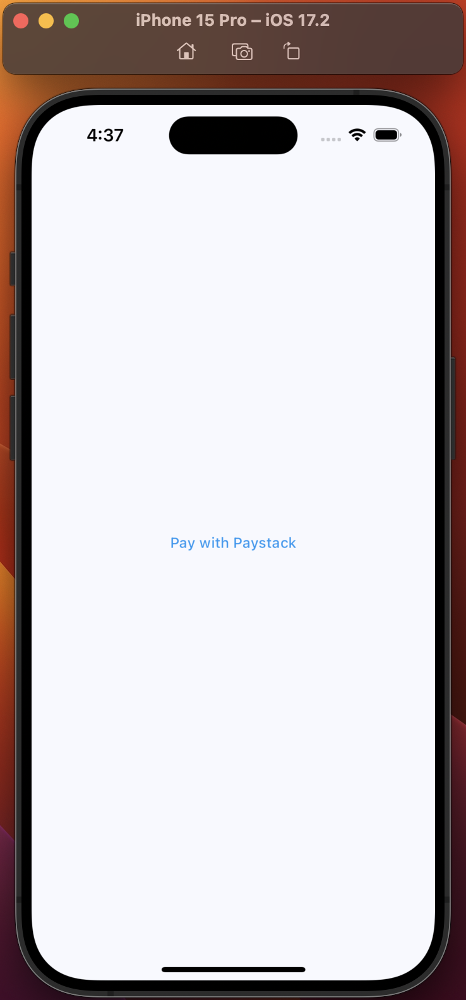
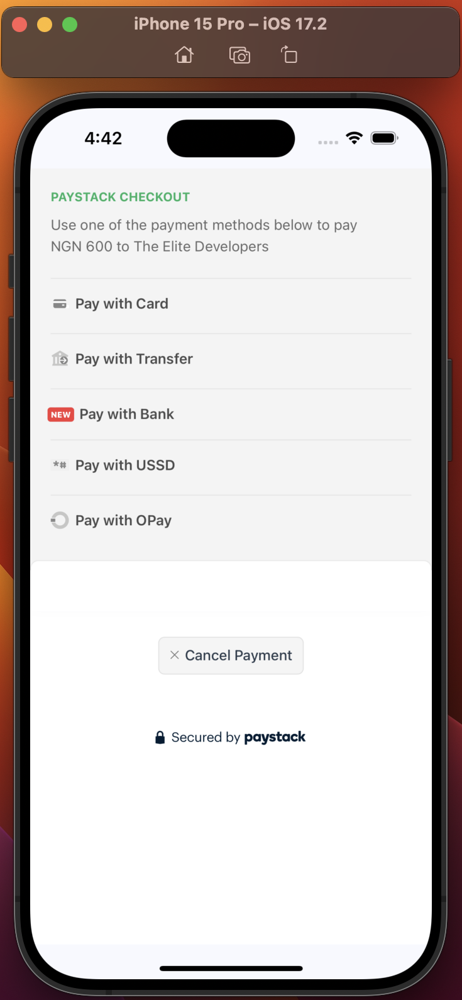
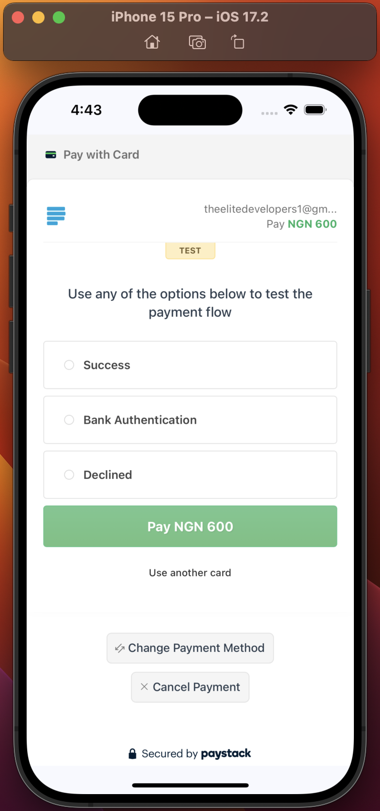
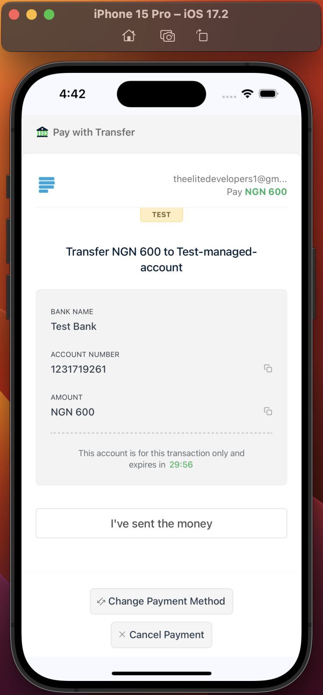
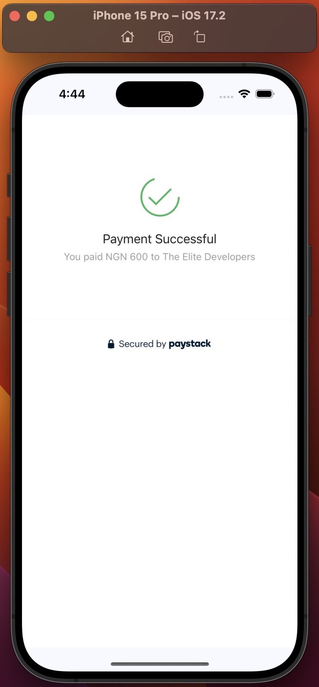

## :moneybag: Paystack Package for Flutter

## Screenshots

|                       Initiate Payment                        |                            Payment Options                            |
|:-------------------------------------------------------------:|:---------------------------------------------------------------------:|
|  |  |

|                            Pay With Card                            |                            Pay With Bank Transfer                            |
|:-------------------------------------------------------------------:|:----------------------------------------------------------------------------:|
|  |  |

|                            Pay With Bank                            |                          Payment Successful                           |
|:-------------------------------------------------------------------:|:---------------------------------------------------------------------:|
|  |  |

A Flutter package that makes it super easy to integrate Paystack in your app with just few lines of code. Supports Android & iOS. Support for other platforms underway.

## :dart: Add dependency to pubspec.yaml:
``` dart
dependencies:
paystack_flutter: 1.0.0
```

## :rocket: How to Use
To use the Paystack package, all you need to do is call the package when a button is clicked. See example implementation below:
``` dart
PaystackFlutter().pay(
    context: context,
    secretKey: 'YOUR_PAYSTACK_SECRET_KEY', // Your Paystack secret key.
    amount: 60000, // The amount to be charged in the smallest currency unit. If amount is 600, multiply by 100(600*100)
    email: 'theelitedevelopers1@gmail.com', // The customer's email address.
    callbackUrl: 'https://callback.com', // The URL to which Paystack will redirect the user after the transaction.
    showProgressBar: true, // If true, it shows progress bar to inform user an action is in progress when getting checkout link from Paystack.
    paymentOptions: [PaymentOption.card, PaymentOption.bankTransfer, PaymentOption.mobileMoney],
    currency: Currency.NGN,
    metaData: {
      "product_name": "Nike Sneakers",
      "product_quantity": 3,
      "product_price": 24000
    }, // Additional metadata to be associated with the transaction
    onSuccess: (paystackCallback){
      ScaffoldMessenger.of(context).showSnackBar(
          SnackBar(content: Text('Transaction Successful::::${paystackCallback.reference}'),
            backgroundColor: Colors.blue,
          ));
    }, // A callback function to be called when the payment is successful.
    onCancelled: (paystackCallback){
      ScaffoldMessenger.of(context).showSnackBar(
          SnackBar(
              content: Text('Transaction Failed/Not successful::::${paystackCallback.reference}'),
            backgroundColor: Colors.red,
          ));
  }, // A callback function to be called when the payment is canceled.
);
```

So, your widget could look something like this:
``` dart
class MyHomePage extends StatefulWidget {
  const MyHomePage({super.key});

  @override
  State<MyHomePage> createState() => _MyHomePageState();
}

class _MyHomePageState extends State<MyHomePage> {

  @override
  Widget build(BuildContext context) {
    return Scaffold(
      body: Center(
        child: Column(
          mainAxisAlignment: MainAxisAlignment.center,
          children: [
            TextButton(
              onPressed: (){
                PaystackFlutter().pay(
                    context: context,
                    secretKey: 'YOUR_PAYSTACK_SECRET_KEY', // Your Paystack secret key.
                    amount: 60000, // The amount to be charged in the smallest currency unit. If amount is 600, multiply by 100(600*100)
                    email: 'theelitedevelopers1@gmail.com', // The customer's email address.
                    callbackUrl: 'https://callback.com', // The URL to which Paystack will redirect the user after the transaction.
                    showProgressBar: true, // If true, it shows progress bar to inform user an action is in progress when getting checkout link from Paystack.
                    paymentOptions: [PaymentOption.card, PaymentOption.bankTransfer, PaymentOption.mobileMoney],
                    currency: Currency.NGN,
                    metaData: {
                      "product_name": "Nike Sneakers",
                      "product_quantity": 3,
                      "product_price": 24000
                    }, // Additional metadata to be associated with the transaction
                    onSuccess: (paystackCallback){
                      ScaffoldMessenger.of(context).showSnackBar(
                          SnackBar(content: Text('Transaction Successful::::${paystackCallback.reference}'),
                            backgroundColor: Colors.blue,
                          ));
                    }, // A callback function for when the payment is successful.
                    onCancelled: (paystackCallback){
                      ScaffoldMessenger.of(context).showSnackBar(
                          SnackBar(
                              content: Text('Transaction Failed/Not successful::::${paystackCallback.reference}'),
                            backgroundColor: Colors.red,
                          ));
                  }, // A callback function for when the payment is canceled/unsuccessful.
                );
              },
              child: const Text(
                'Pay with Paystack',
                style: TextStyle(
                  color: Colors.blue,
                ),
              ),
            ),
          ],
        ),
      ),
    );
  }
}
```

## :memo: Detailed explanation of parameters
Note that some of the parameters are optional. Below is a table giving exact details:

| Parameter          | Data type                  | Required/Optional | Details                                                                                                                                                                                                                                                                                                                             |
|--------------------|----------------------------|-------------------|-------------------------------------------------------------------------------------------------------------------------------------------------------------------------------------------------------------------------------------------------------------------------------------------------------------------------------------|
| context            | BuildContext               | Required          | Current build context                                                                                                                                                                                                                                                                                                               |
| secretKey          | String                     | Required          | Your Paystack's secret key. You can get this from your Paystack dashboard under Settings. Try not to save your key locally.                                                                                                                                                                                                         |
| amount             | double                     | Required          | The amount to be charged in the smallest currency unit. If amount is 600, multiply by `100`(600*100)                                                                                                                                                                                                                                |
| callbackUrl        | String                     | Required          | The URL to which Paystack will redirect the user after the transaction. Your callback can be anything. Even if you have set the callbackUrl on your Paystack dashboard and you set something different in your code, Paystack overrides the one set on your dashboard. Your callback can be: https://callback.com or any other URL. |
| onSuccess          | Function(PaystackCallback) | Required          | A callback function to be called when the payment is successful. This function returns an instance of a PaystackCallback class that has properties like reference and accessCode that you can access to confirm from your backend or do anything with.                                                                              |
| onCancelled        | Function(PaystackCallback) | Required          | A callback function to be called when the payment is unsuccessful. This function returns an instance of a PaystackCallback class that has properties like reference and accessCode that you can access to confirm if transaction was truly unsuccessful.                                                                            |
| reference          | String                     | Optional          | A custom reference for the transaction. If you do not pass a reference, Paystack will generate one automatically for you.                                                                                                                                                                                                           |
| confirmTransaction | bool                       | Optional          | If set to true, the package checks with paystack using the reference to confirm if the transaction was truly successful. In most cases, you'll have to do this through the backend, but the package gives you the option to do it in your app. Default value is `FALSE`                                                             |
| metadata           | dynamic(json)              | Optional          | Additional metadata to be associated with the transaction. This is usually the goods/services your customer is trying to make payment for. It's expected in json format. It makes it easy to provide value to your customer by just using the reference to get the data after confirming successful payment.                        |
| paymentOptions     | List<PaymentOption(enum)>  | Optional          | A list of payment options allowed for the transaction. Please, `leave empty` or don't include if you want to use the payment options set from your dashboard. To use: [`PaymentOption.card`, `PaymentOption.bankTransfer`, `PaymentOption.bank`, `PaymentOption.ussd`]                                                              |
| currency           | enum                       | Optional          | The currency used for the transaction. If omitted, it uses the default Currency of the country associated with your Paystack account. Example: Currency.NGN. There are 5 currency enum options: `NGN(Naira)`, `USD(Dollars)`, `GHS(Ghanian Cedi)`, `ZAR(South African Rand)`, `KES(Kenyan Shilling)`                                |
| showProgressBar    | bool                       | Optional          | If true, it shows progress bar to inform user an action is in progress when getting checkout link from Paystack. Default value is `TRUE`                                                                                                                                                                                            |


# :grey_exclamation: Enums and their values
## paymentOptions:
The `paymentOptions` parameter takes a List of PaymentOption enums like this:
``` dart
paymentOptions: [PaymentOption.card, PaymentOption.bankTransfer, PaymentOption.bank, PaymentOption.ussd]
```

Here's a detailed comment that describes what each of these enums represent.
``` dart
  /// - [paymentOptions] A list of payment options allowed for the transaction.
  ///     - **Available Payment Options:**
  ///       - [PaymentOption.card] Allows payment with debit/credit cards.
  ///       - [PaymentOption.bank] Allows payment via bank.
  ///       - [PaymentOption.bankTransfer] Allows payment via bank transfer (alternative to `bank`).
  ///       - [PaymentOption.ussd] Allows payment via USSD mobile banking.
  ///       - [PaymentOption.mobileMoney] Allows payment via mobile money wallets (e.g., Mpesa, MTN Mobile Money).
  ///       - [PaymentOption.eft] Allows payment via EFT (Electronic Funds Transfer).
  ///       - [PaymentOption.qr] Allows payment via QR codes.
```

**NOTE:** Don't forget that the paymentOptions is optional and that if you don't include it, Paystack will use the default payment options already set on your Paystack dashboard.
So, leave it empty if that is what you want.

## currency:
The `currency` parameter takes a Currency enum like this:
``` dart
currency: Currency.NGN
```

Here's the list of currency that Paystack supports:
``` dart
/// - [currency] The currency used for the transaction. If omitted, it uses the default Currency of the country associated with your Paystack account.
  ///     - **Supported Currencies:**
  ///       - [Currency.NGN] (Nigerian Naira)
  ///       - [Currency.USD] (US Dollar)
  ///       - [Currency.GHS] (Ghanaian Cedi)
  ///       - [Currency.ZAR] (South African Rand)
  ///       - [Currency.KES] (Kenyan Shilling)
```

## :white_check_mark: Success Callback(After successful payment)
Paystack recommends that you use the reference to make a call to your backend to confirm if transaction was indeed successful before you provide value to your customer.
The onSuccess callback makes it easy to get the `reference` or `accessCode` and make this call to your backend like this:
``` dart
onSuccess: (paystackCallback){
  //go ahead to provide value to the customer.
  ScaffoldMessenger.of(context).showSnackBar(
      SnackBar(content: Text('Transaction Successful::::${paystackCallback.reference}'),
        backgroundColor: Colors.blue,
      ));
}
```
It's also possible to use the package to confirm if a transaction was successful by just including the `confirmTransaction` parameter like this:
``` dart
confirmTransaction: true
```
When included, the package makes sure to confirm directly from Paystack if that transaction was truly successful. If it was, it will execute the onSuccess callback, and if it wasn't successful, it'll call the onCancelled callback.

## :negative_squared_cross_mark: Cancelled/Unsuccessful Callback(After an Unsuccessful payment)
The onCancelled callback is executed when if the payment was unsuccessful. You can go ahead to either display a message to the customer or take the reference and do something with it like confirming if it was truly unsuccessful.
Remember that you can always get access to the `reference` and `accessCode` from the callback:
``` dart
onCancelled: (paystackCallback){
  ScaffoldMessenger.of(context).showSnackBar(
      SnackBar(
          content: Text('Transaction Failed/Not successful::::${paystackCallback.reference}'),
        backgroundColor: Colors.red,
      ));
}
```